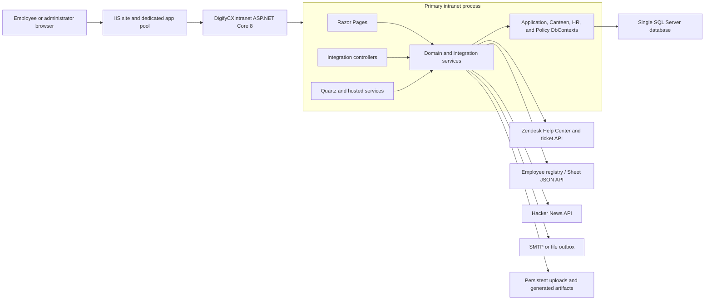
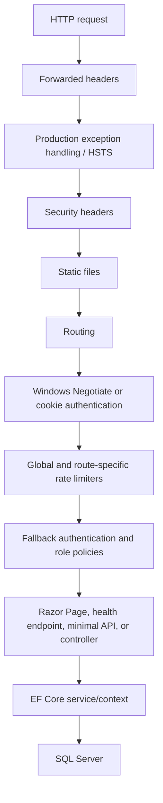
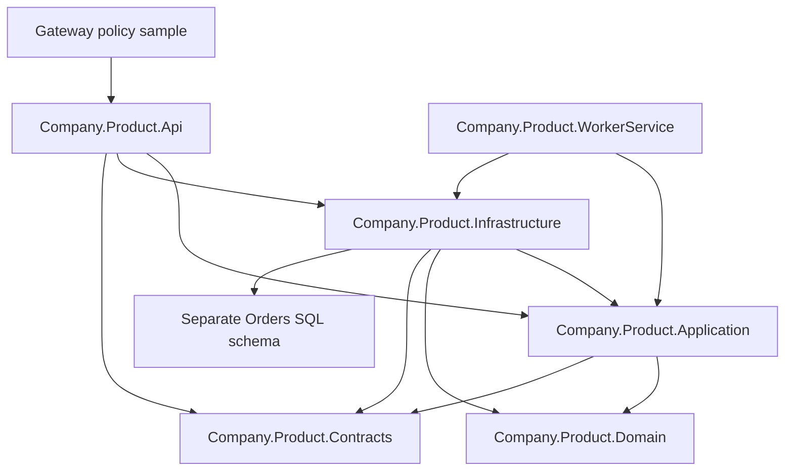
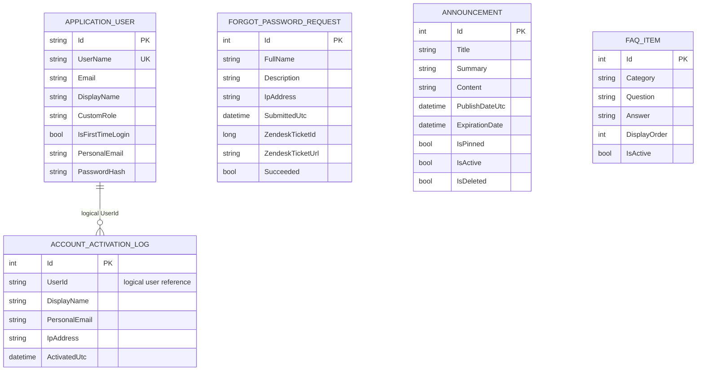
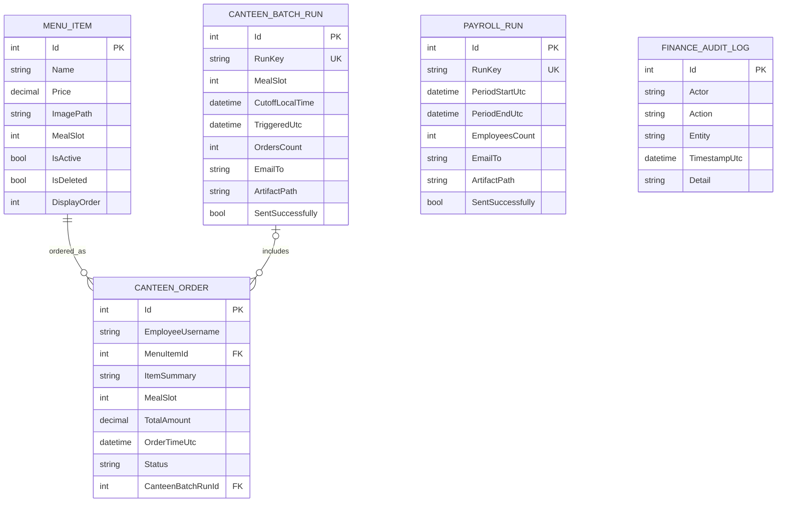
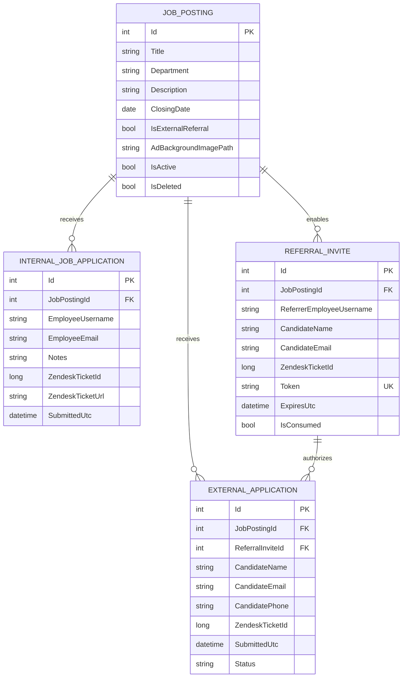
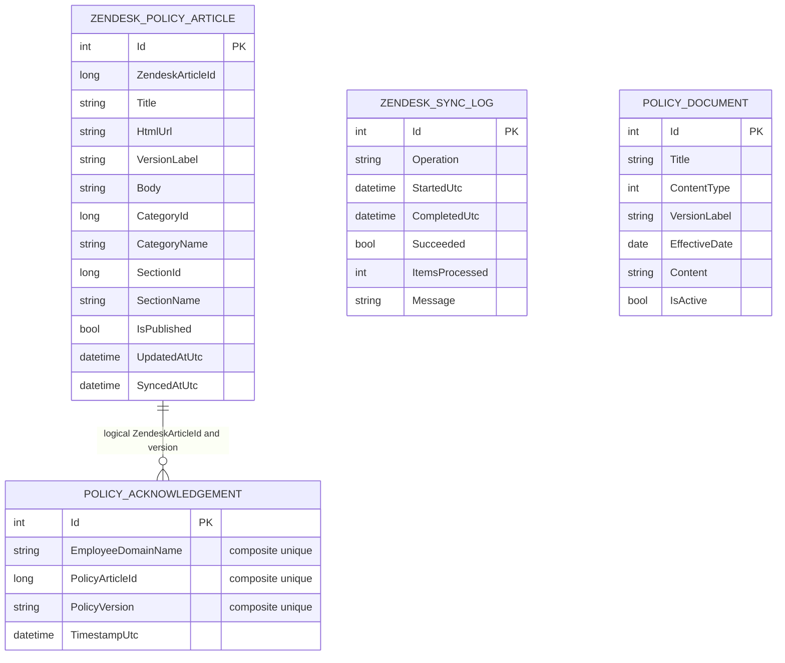
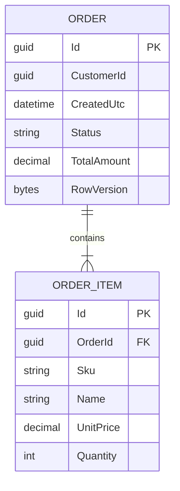

# DigifyCX Intranet

## Technical handover and dependencies

- [Technical handover](HANDOVER.md): ownership, setup, credential rotation, verification and recovery.
- [Dependency and API/OAuth configuration list](DEPENDENCIES.md): runtime, external services and configuration inventory.

**Handover requirement:** all API/OAuth credentials and related shared/deployment secrets in use must be rotated or reissued, configured and tested under the receiving owner. Completion must be recorded; these documentation changes do not rotate live credentials.

DigifyCX Intranet is an internal employee-services platform built on ASP.NET Core 8. The primary application combines company communications, canteen ordering and payroll exports, internal recruitment, policy acknowledgement, account lifecycle management, and role-scoped administration in one IIS-hosted web application.

This repository also contains a separate `Company.Product` Clean Architecture baseline for an orders API. That baseline is part of the solution and test suite, but it is not wired into or deployed with the DigifyCX intranet.

> Documentation scope: this README describes the current source tree. It deliberately contains no passwords, API tokens, connection strings, or other deployment secrets.

For a focused technical orientation covering architecture, integrations, runtime mechanisms, data ownership, hosting, and operational boundaries, see [System Context](docs/system-context.md).

## Contents

- [Product scope](#product-scope)
- [Repository and project map](#repository-and-project-map)
- [System architecture](#system-architecture)
- [Technology stack](#technology-stack)
- [Roles and authorization](#roles-and-authorization)
- [Features](#features)
- [Business use cases](#business-use-cases)
- [Functional specification](#functional-specification)
- [Data model and ERDs](#data-model-and-erds)
- [Background processing and integrations](#background-processing-and-integrations)
- [Configuration and secrets](#configuration-and-secrets)
- [Local development](#local-development)
- [Testing](#testing)
- [Deployment](#deployment)
- [Operations, health, and recovery](#operations-health-and-recovery)
- [Security model](#security-model)
- [Performance and scaling](#performance-and-scaling)
- [Known boundaries and technical debt](#known-boundaries-and-technical-debt)

## Product scope

The primary product is the root `DigifyCXIntranet.csproj` application. It is a server-rendered ASP.NET Core Razor Pages application with a small controller surface for integrations. It is intended for an internal company network and currently supports:

- Employee sign-in, account activation, forgotten-password requests, and read-only profiles.
- Announcements, FAQs, recent jobs, policy availability, and personal canteen spend on the home page.
- Canteen menu browsing, ordering, order history, scheduled batch exports, and payroll summaries.
- Internal job applications, employee referrals, external candidate applications, and Zendesk ticket routing.
- Zendesk policy synchronization, policy reading, version-specific acknowledgement, and HR compliance exports.
- Role-scoped administration for canteen, HR, finance, system configuration, announcements, and users.
- SQL health reporting, security headers, rate limiting, audit records, and deployment backup scripts.

The `Company.Product` projects under `src/` are a second, independent implementation baseline. They demonstrate Clean Architecture around a generic order aggregate and authenticated HTTP API. They do not share the intranet models, database contexts, UI, or deployment scripts.

## Repository and project map

| Path/project | Type | Purpose | Deployment status |
|---|---|---|---|
| `DigifyCXIntranet.csproj` | ASP.NET Core Web | Primary Razor Pages intranet, API webhook, hosted jobs, Identity, and EF Core persistence | Primary IIS deployment |
| `tests/DigifyCXIntranet.Tests` | xUnit | Focused tests for intranet security, configuration, uploads, policy filters, and page helpers | Runs with the solution |
| `src/Company.Product.Domain` | Class library | Order aggregate, order items, domain states, and invariants | Reference baseline only |
| `src/Company.Product.Contracts` | Class library | Versioned request/response DTOs and API error codes | Reference baseline only |
| `src/Company.Product.Application` | Class library | Order use-case handlers, validators, read models, and persistence abstractions | Reference baseline only |
| `src/Company.Product.Infrastructure` | Class library | EF Core SQL Server context, repositories, read services, unit of work, and clock | Reference baseline only |
| `src/Company.Product.Api` | ASP.NET Core Web API | JWT-protected order endpoints, OpenAPI, middleware, CORS, rate limiting, and health checks | Not deployed by intranet scripts |
| `src/Company.Product.WorkerService` | .NET Worker | Infrastructure composition and a five-minute operational heartbeat | Not deployed by intranet scripts |
| `src/Company.Product.Gateway` | YAML configuration | Example gateway route and edge-security policy for the orders API | Configuration sample only |
| `tests/Company.Product.*` | xUnit suites | Domain, application, architecture, infrastructure, integration, and contract tests | Runs with the solution |
| `deploy/` | PowerShell and Markdown | IIS setup, safe publishing, secret scanning, copy/backup, environment setup, firewall planning, and runbooks | Manual/operator-controlled |

### Important project boundary

The root web project explicitly excludes `src/**` and `tests/**` from its compile and publish items. The root intranet and `Company.Product` baseline build together through `DigifyCXIntranet.sln`, but they are separate applications.

## System architecture

### Primary intranet runtime



The primary application is a modular monolith. Feature boundaries are expressed through page folders, services, models, and specialized EF Core contexts. All four intranet contexts use the same `ConnectionStrings:DefaultConnection` and therefore target one physical database.

### Primary request path



### `Company.Product` Clean Architecture baseline



The dependency tests enforce that `Domain` does not depend on API or Infrastructure and that `Application` does not depend on API or Infrastructure.

## Technology stack

| Area | Technology |
|---|---|
| Runtime | .NET 8 / ASP.NET Core 8 |
| Primary UI | Razor Pages, Razor views, Bootstrap static assets, custom CSS and JavaScript |
| Primary integration API | ASP.NET Core controllers and minimal API endpoint |
| Authentication | ASP.NET Core Identity, cookie authentication, or Windows Negotiate authentication |
| Authorization | Claims and policy-based role authorization |
| Persistence | Entity Framework Core 8 with SQL Server |
| Scheduling | Quartz.NET for canteen, payroll, email outbox, policy sync, user sync, and tech-news refresh |
| Spreadsheet export | ClosedXML |
| HTTP integrations | `IHttpClientFactory`, `System.Text.Json` |
| Email delivery | SMTP or a local file outbox fallback |
| Health | ASP.NET Core health checks and EF database connectivity checks |
| API baseline | Controllers, JWT bearer authentication, Swagger/OpenAPI, RFC 7807 responses |
| Testing | xUnit, FluentAssertions, ASP.NET Core test host, EF Core InMemory, NetArchTest, coverlet |
| Hosting | IIS with ASP.NET Core Module V2 and a dedicated application pool |
| Deployment automation | PowerShell publish, validation, backup, copy, environment, IIS, and firewall scripts |

Node.js is required only when rebuilding the committed Tailwind CSS asset; it is not required by the deployed IIS process.

## Roles and authorization

### Application roles

- `Employee`
- `CanteenAdmin`
- `HrAdmin`
- `FinanceAdmin`
- `SystemAdmin`
- `SuperAdmin`

All pages are authenticated by the fallback policy unless explicitly marked anonymous. The application can obtain roles from the database-backed `ApplicationUser.CustomRole` during cookie login or from configured claims/role mappings when Windows authentication is used.

### Capability matrix

| Capability | Employee | CanteenAdmin | HrAdmin | FinanceAdmin | SystemAdmin | SuperAdmin |
|---|:---:|:---:|:---:|:---:|:---:|:---:|
| Employee pages and own profile/activity | Yes | Yes | Yes | Yes | Yes | Yes |
| Open admin console | No | Yes | Yes | Yes | Yes | Yes |
| Manage canteen menu and batches | No | Yes | No | No | Yes | Yes |
| Manage jobs and Zendesk policies | No | No | Yes | No | Yes | Yes |
| View finance ledger and finance audit | No | No | No | Yes | Yes | Yes |
| Manage FAQs/system content | No | No | No | No | Yes | Yes |
| Manage announcements | No | No | Yes | No | No | No |
| Create/manage users | No | No | No | No | Yes | Yes |
| Assign `SystemAdmin` to another user | No | No | No | No | No | Yes |
| Assign `SuperAdmin` | No | No | No | No | No | No |

The announcements policy currently requires `HrAdmin` specifically. `SystemAdmin` and `SuperAdmin` do not automatically inherit that policy unless they also receive the HR role through claims configuration.

### Authentication modes

| Mode | Selection | Behavior |
|---|---|---|
| Windows/Negotiate | Non-Development and `AuthMode:UseWindowsAuthenticationInNonDevelopment=true` | Uses the authenticated Windows identity and configuration-based role claims |
| Cookie/database | Development, or the Windows-auth flag is false | Validates configured development users in Development or password hashes in `AspNetUsers` |
| Temporary internal HTTP | Explicit `AuthMode:AllowInsecureHttpForInternalTest=true` | Allows cookies to follow the current HTTP request; must be disabled for final HTTPS production |

Cookie sessions use HTTP-only, SameSite Lax cookies, an eight-hour lifetime, and sliding expiration. Production defaults require secure cookies and HTTPS. Database sessions carry the user ID and Identity security stamp; the app revalidates them against SQL with a two-minute cache so password resets, account resets, deletions, and role changes revoke stale cookies promptly.

## Features

### Employee experience

- Home dashboard with active announcements, recent jobs, allowed/published policy count, latest policies, role, and current-month canteen spend.
- Read-only profile showing account identity, role, activation state, current-month canteen spend, five recent orders, five recent internal applications, five recent acknowledgements, and pending policy count.
- Announcement and FAQ libraries.
- Active canteen menu, order submission, fifty recent personal orders, and twelve monthly personal totals.
- Active job listings, internal applications with resume validation, and external candidate referrals.
- Zendesk-backed policy library grouped by category and section, search, article viewing, and version-specific acknowledgement.
- Account activation, password setup, forgotten-password request, and post-activation sign-in.

### Canteen and finance

- Menu item creation, image upload, edit, activation/deactivation, ordering, and soft deletion.
- Existing menu image retention when an edit does not include a replacement file.
- Uploaded menu images under `wwwroot/uploads/menu-items`.
- Separate breakfast and lunch menu slots.
- Scheduled breakfast/lunch order batching with idempotent daily run keys.
- XLSX batch attachments delivered by SMTP or written to the outbox.
- Finance ledger filtering/export and finance audit history.
- Monthly canteen payroll aggregation and XLSX delivery to the configured payroll inbox.

### HR and recruitment

- Job posting creation/editing, active state, soft deletion, closing dates, visual ad fields, and optional uploaded backgrounds.
- Internal applications routed to Zendesk and recorded after successful ticket creation.
- Employee referral submissions routed to Zendesk and recorded as referral/application data.
- Token-based anonymous external-application page for valid, unexpired, unconsumed referral invites.
- Resume/image file validation based on policy, extension, size, and file signature.

### Policies and compliance

- Zendesk Help Center category, section, and article synchronization.
- Optional section allowlist through `ZendeskSync:AllowedSectionIds`.
- Published-only policy views and version labels based on Zendesk update timestamps.
- Version-specific employee acknowledgements with a uniqueness constraint.
- HR compliance filters and CSV export.
- Sync status logs and manual sync from Admin > Policies.

### Account and administration

- Employee registry synchronization into ASP.NET Core Identity.
- First-time activation with a configured default password and optional registry lookup.
- User creation with role-assignment limits.
- Zendesk-based forgotten-password ticket creation and inbound reset webhook.
- Optional, explicitly enabled configured test-user seeding for internal test environments.
- Administrative dashboard with policy-checked links and scoped counts.

### Operations

- SQL connectivity validation during startup.
- SQL transport-security validation before serving traffic.
- `/health/database` database health endpoint.
- Global fixed-window request limiter.
- Security headers on all primary app responses, staged Content Security Policy reporting, secure antiforgery/TempData cookies, and no-store handling for authenticated pages.
- SQL-persistent Quartz scheduling for policy sync, tech-news refresh, user-registry sync, canteen jobs, email outbox dispatch, and monthly payroll export.
- Publish-output secret scan and IIS deployment backup/rollback tooling.

## Business use cases

The following use cases describe the implemented primary intranet behavior.

| ID | Actor | Goal | Main flow and result |
|---|---|---|---|
| UC-01 | Employee | Sign in | The app selects Windows or cookie auth. Cookie mode validates a Development-only configured account or an `AspNetUsers` password hash, creates name/display/role claims, and starts a session. |
| UC-02 | New employee | Activate an account | The employee supplies full name and the configured default password. The app resolves the Identity user, checks first-time state, carries activation context to password setup, stores a hash, logs activation, and signs the user in. |
| UC-03 | Employee | Request password help | The employee submits a full name. The app creates a Zendesk ticket and records success/failure, ticket details, time, and source IP in `ForgotPasswordRequest`. |
| UC-04 | IT/Zendesk | Re-open account activation | An authenticated webhook matches an employee by display name and resets only password state, first-time state, and security stamp. The employee can then activate again. |
| UC-05 | Employee | Place a canteen order | The employee selects an active, non-deleted menu item. The app snapshots item name, meal slot, and price into an order owned by the current short username and writes a finance audit record. |
| UC-06 | Canteen scheduler | Dispatch meal orders | At the configured cutoff, the app claims unbatched orders for the meal slot, creates one daily batch, generates XLSX, sends/writes it, marks orders batched, and records success or failure. |
| UC-07 | Finance administrator | Review canteen charges | Finance views ledger/audit data and exports the selected ledger data. Read access is limited by the `FinanceLedger` policy. |
| UC-08 | Payroll scheduler | Produce monthly deductions | On the configured monthly date, the app groups canteen spend by employee, creates an idempotent payroll run, generates XLSX, delivers it, and audits the export. |
| UC-09 | Employee | Apply for an internal job | The employee opens an active job, submits contact details, notes, and a required resume. A successful Zendesk ticket is required before the application is persisted. |
| UC-10 | Employee | Refer an external candidate | The employee selects a referral-enabled job, supplies candidate details and optional resume, and creates a Zendesk ticket. On success, referral and external-application records are stored. |
| UC-11 | External candidate | Apply through an invite | A candidate presents a valid, unexpired, unused token, uploads a required resume, and submits. The app creates the Zendesk ticket/application and consumes the invite. |
| UC-12 | Employee | Read and acknowledge a policy | The employee can open a published article in an allowed Zendesk section. Acknowledgement is stored once per employee, article, and version. |
| UC-13 | HR administrator | Review compliance | HR filters acknowledgements by employee, article, and date, views up to 500 rows, or exports all matching rows to CSV. |
| UC-14 | HR administrator | Synchronize policies | HR starts a sync or waits for the daily worker. Only allowed sections are cached when configured; excluded articles are counted as skipped and stale out-of-scope cache rows are removed. |
| UC-15 | System administrator | Create an employee account | The admin supplies full name, email, and an allowed role. The app derives a dot-separated username and creates an activation-ready Identity account. |
| UC-16 | Registry worker | Reconcile employees | At the configured UTC schedule, the worker reads the employee registry, creates missing employees, refreshes names/placeholders, and optionally removes accounts absent from the source. |
| UC-17 | Employee | Review personal activity | The profile resolves the current username and loads only matching canteen, internal-job, and acknowledgement rows. Admin roles receive no cross-employee visibility on this page. |

### Core business rules

- Current-user ownership is represented by the normalized short username in cross-domain activity tables.
- Menu, job, and announcement deletion is soft deletion where implemented.
- A menu item must be inactive before it can be soft-deleted.
- New menu items require an image; editing without a new upload preserves the stored path.
- Canteen prices and order totals use SQL `decimal(18,2)`.
- Batch and payroll `RunKey` values are unique to prevent duplicate scheduled outputs.
- Internal applications are persisted only after Zendesk accepts the ticket.
- Policy acknowledgement is unique per employee, Zendesk article, and policy version.
- Empty `ZendeskSync:AllowedSectionIds` means no section filter; configure an allowlist for production policy scope.
- Production SQL normally requires `Encrypt=True;TrustServerCertificate=False`.
- Internal-test exceptions for HTTP cookies, configured users, and SQL certificate trust default to disabled.

## Functional specification

### Route catalogue

| Route | Access | Function |
|---|---|---|
| `/` | Authenticated | Employee dashboard and personalized summary |
| `/Profile` | Authenticated | Read-only current-user account and activity summary |
| `/Announcements` | Authenticated | Active company announcements |
| `/Faq` | Authenticated | Active FAQs grouped for employee use |
| `/Canteen` | Authenticated | Menu, new order submission, own order history, and monthly totals |
| `/Jobs` | Authenticated | Active jobs and employee referral form |
| `/Jobs/Apply/{id}` | Authenticated | Internal application and required resume upload |
| `/External/Apply?token=...` | Anonymous with valid token | External candidate application |
| `/Policies` | Authenticated | Allowed published policy library and search |
| `/Policies/View/{id}` | Authenticated | Policy article and acknowledgement action |
| `/Policies/ComplianceReport` | HR policy | Compliance filtering and CSV export |
| `/Account/Login` | Anonymous in cookie mode | Application login |
| `/Account/Activate` | Anonymous | First-time or reset activation entry |
| `/Account/ResetPassword` | Anonymous with activation context | Password setup and automatic login |
| `/Account/ForgotPassword` | Anonymous | Zendesk password-help request |
| `/Admin` | Any admin role | Role-aware administration landing page |
| `/Admin/Menu`, `/Admin/MenuEdit/{id}`, `/Admin/Canteen` | Canteen policy | Menu and canteen batch operations |
| `/Admin/Jobs`, `/Admin/JobEdit/{id}`, `/Admin/Policies` | HR policy | Job and policy-sync operations |
| `/Admin/Announcements`, `/Admin/AnnouncementEdit/{id}` | Announcement policy | Announcement lifecycle |
| `/Admin/Faq`, `/Admin/FaqEdit/{id}` | System policy | FAQ lifecycle |
| `/Admin/Users` | User-management policy | User listing and creation |
| `/Finance/CanteenLedger`, `/Finance/Audit` | Finance policy | Ledger/export and audit records |
| `/health/database` | Endpoint mapped by app | SQL reachability result |
| `/api/technews` | Fallback auth applies | Sanitized in-memory tech-news cache |
| `/api/zendesk/reset-password` | Anonymous plus shared-secret header | Zendesk-driven password reset state transition |

Razor route aliases omit `/Index`; for example, `Pages/Profile/Index.cshtml` is served as `/Profile`.

### Read and write behavior

| Module | Reads | Writes |
|---|---|---|
| Home/Profile | Bounded, mostly `AsNoTracking` projections and counts | None |
| Announcements/FAQ employee pages | Active rows | None |
| Canteen | Active menu and current-user orders | New orders and finance audit entries |
| Jobs | Active postings | Referral invites, internal/external applications, Zendesk tickets, audit entries |
| Policies | Allowed published articles and acknowledgements | Current-user version acknowledgement |
| Admin | Role-scoped module data | Create/edit/activate/soft-delete operations and sync commands |
| Finance | Orders and audit records | Export audit records where implemented |
| Account | Identity and activation state | Password hash/state, activation logs, help-request logs |

## Data model and ERDs

These are conceptual ERDs for the current model. ASP.NET Core Identity support tables are summarized rather than expanded. Relationships labeled "logical" are joined by values in application code and are not database foreign keys.

### Identity, account lifecycle, and content



`ApplicationUser` extends ASP.NET Core Identity's `IdentityUser`; tables such as roles, claims, logins, tokens, and user-role joins still exist in the Identity schema even though the app primarily uses `CustomRole` and claims.

### Canteen, batches, payroll, and finance



Orders snapshot the menu name, meal slot, and price so later menu edits do not rewrite historical charges. `PayrollRun` is an aggregate output record and has no row-level foreign key to orders.

### Recruitment



### Policies and Zendesk cache



`PolicyDocument` is a local/legacy model. The active employee policy experience uses `ZendeskPolicyArticle`; the current policy-edit page redirects back to the Zendesk policy administration page.

### `Company.Product` order baseline



The baseline aggregate enforces a customer, at least one valid item, rounded monetary totals, and legal state transitions between Draft, Paid, and Cancelled. `RowVersion` provides optimistic concurrency support.

### Context ownership

| Context | Entity set |
|---|---|
| `ApplicationDbContext` | Identity plus all intranet domain entities; owns the migration set |
| `CanteenDbContext` | Menu items, orders, batches, payroll runs, finance audit logs |
| `HrDbContext` | Job postings, referral invites, internal applications, external applications |
| `PolicyDbContext` | Local policies, Zendesk articles, acknowledgements, sync logs |
| `Company.Product.Infrastructure.AppDbContext` | Separate `Orders` and `OrderItems` baseline schema |

The specialized intranet contexts map the same physical tables as `ApplicationDbContext`. Schema changes must be created and applied through `ApplicationDbContext` unless the context strategy is deliberately changed.

### Database indexes and constraints

- Canteen orders: `(EmployeeUsername, OrderTimeUtc)`.
- Menu availability: `(IsDeleted, IsActive, MealSlot, DisplayOrder)`.
- Canteen batch and payroll run keys: unique.
- Finance audit: `TimestampUtc`.
- Job availability: `(IsDeleted, IsActive, ClosingDate)`.
- Referral token: unique.
- Policy acknowledgement: unique `(EmployeeDomainName, PolicyArticleId, PolicyVersion)`.
- Policy sync log: `StartedUtc`.
- Zendesk article browsing: `(SectionName, Title)`.

## Background processing and integrations

### Scheduled work

| Process | Schedule | Data effect | External effect |
|---|---|---|---|
| Breakfast canteen batch | Quartz cron from `CanteenBatching:BreakfastCron` | Creates batch run; links and marks orders | XLSX to canteen inbox or outbox |
| Lunch canteen batch | Quartz cron from `CanteenBatching:LunchCron` | Creates batch run; links and marks orders | XLSX to canteen inbox or outbox |
| Monthly payroll | Configured day/hour/time zone | Creates payroll run from employee order totals | XLSX to payroll inbox or outbox |
| Zendesk policy sync | Immediately on worker start, then every 24 hours | Upserts allowed articles, removes cached out-of-scope articles, writes sync log | Reads Zendesk Help Center API |
| Tech news refresh | Immediately on worker start, then hourly | Replaces an in-memory cache | Reads Hacker News API |
| Employee registry sync | Configured UTC time and interval | Creates/updates and optionally deletes Identity users | Reads configured Sheet JSON API |

The scheduled workers execute in the primary web process. If the app pool is stopped, recycled, or idle, jobs do not run until the process is active again. Run-key uniqueness protects canteen/payroll jobs from duplicate processing after restarts.

### External systems

| System | Direction | Uses |
|---|---|---|
| SQL Server | Read/write | Identity, content, orders, jobs, policies, logs, and job state |
| Zendesk Help Center | Inbound to app cache | Policy categories, sections, and articles |
| Zendesk ticket API | Outbound | Internal applications, referrals, and forgotten-password requests |
| Zendesk webhook | Inbound | Re-opens activation state after approved password reset |
| Employee registry / Sheet API | Inbound | Identity account reconciliation and activation validation |
| Hacker News API | Inbound | Non-critical tech-news cache |
| SMTP server | Outbound | Canteen and payroll workbooks |
| File outbox | Local fallback | Stores `.eml`/attachment artifacts when SMTP is disabled |

## Configuration and secrets

ASP.NET Core configuration is read from `appsettings.json`, environment-specific providers, user secrets in local Development, and environment variables. Environment variables use double underscores, for example:

```text
ConnectionStrings__DefaultConnection
ZendeskSync__ApiToken
ZendeskSync__AllowedSectionIds__0
```

### Configuration groups

| Section | Purpose | Sensitive fields/examples |
|---|---|---|
| `ConnectionStrings` | SQL Server connection | `DefaultConnection` is sensitive |
| `AdminAccess` | Allowed Windows identities and per-user role mappings | Usernames may be internal data |
| `AuthMode` | Windows/cookie selection and internal-test switches | Configured test-user passwords are secrets |
| `Activation` | First-time password and registry validation | Default password and Sheet URL are sensitive |
| `Smtp` | Mail transport | Username and password are secrets |
| `RoutingInboxes` | Canteen, hiring, referral, and payroll destinations | Internal addresses |
| `CanteenBatching` | Time zone and breakfast/lunch cron expressions | No secret expected |
| `Payroll` | Monthly run day, hour, and time zone | No secret expected |
| `TechNews` | Base URL, item count, timeout, concurrency | No secret expected |
| `HomePage` | Recent-job date window | No secret expected |
| `ZendeskSync` | Help Center, auth, ticket form/group/custom field mappings, section allowlist | API token and email are sensitive |
| `UserRegistrySync` | Registry URL, schedule, timeout, deletion behavior | Registry URL may be sensitive |
| `Outbox` | File fallback enablement and folder | Path only |
| `ZendeskWebhook` | Inbound webhook verification | Shared secret is sensitive |
| `SqlServerSecurity` | Internal-test certificate escape hatch | Must remain false for proper production |

### Required production principles

- Keep real secrets out of tracked `appsettings` files.
- Scope live environment variables to the dedicated `DigifyCXIntranet` app pool on a shared server.
- Do not publish `appsettings.Development.json`, `appsettings.Test.json`, `appsettings.Production.json`, local variants, example files, or `*.secrets.json`.
- Keep `AuthMode:AllowInsecureHttpForInternalTest`, `AuthMode:SeedConfiguredTestUsers`, and `SqlServerSecurity:AllowTrustServerCertificateForInternalTest` false for final HTTPS production.
- Configure `ZendeskSync:AllowedSectionIds` so only approved Help Center sections become intranet policies.
- Use `Encrypt=True;TrustServerCertificate=False` with a SQL Server certificate trusted by the application server.
- Never log secret values or full authorization/webhook headers.

The root project excludes environment-specific appsettings files, deployment scripts, artifacts, outbox data, and uploaded files from publish output.

## Local development

### Prerequisites

- .NET 8 SDK.
- SQL Server or SQL Server Express reachable by the developer account.
- Optional: `dotnet-ef` 8.x for migration commands.
- Optional integration credentials for Zendesk, SMTP, and the registry API.

IIS and Node.js are not required for ordinary local development.

### Configure a local database

Use .NET user secrets or an ignored local configuration file. Do not put a real connection string in tracked configuration.

```powershell
dotnet user-secrets set "ConnectionStrings:DefaultConnection" "<local SQL Server connection string>" --project .\DigifyCXIntranet.csproj
```

For local Development only, weak SQL certificate settings are logged as a warning instead of blocking startup. Production behavior is strict.

### Apply the intranet schema

The solution has multiple contexts, so specify `ApplicationDbContext` explicitly:

```powershell
dotnet ef database update `
  --context ApplicationDbContext `
  --project .\DigifyCXIntranet.csproj `
  --startup-project .\DigifyCXIntranet.csproj
```

The primary app does not call `Database.Migrate()` on startup. Operators remain in control of migration execution.

### Run the primary intranet

```powershell
dotnet restore .\DigifyCXIntranet.sln
dotnet run --project .\DigifyCXIntranet.csproj
```

Development uses cookie authentication and can use configured Development users. Do not commit those passwords.

### Run the API baseline

Configure the baseline's `ConnectionStrings:SqlServer`, `Database`, and `Authentication:Jwt` settings, then run:

```powershell
dotnet run --project .\src\Company.Product.Api\Company.Product.Api.csproj
```

Swagger is available only in Development. The order endpoints require bearer scopes `orders.read` or `orders.write`; `/api/v1/operational/ping` is anonymous.

## Testing

### Build everything

```powershell
dotnet build .\DigifyCXIntranet.sln
```

### Run all tests

```powershell
dotnet test .\DigifyCXIntranet.sln --no-build
```

### Run only primary intranet tests

```powershell
dotnet test .\tests\DigifyCXIntranet.Tests\DigifyCXIntranet.Tests.csproj
```

### Collect coverage

```powershell
dotnet test .\DigifyCXIntranet.sln --collect:"XPlat Code Coverage"
```

### Test suite coverage

- Intranet SQL connection policy, configured test accounts, policy section filtering, upload signatures/path safety, and menu image retention.
- Order domain invariants and state transitions.
- Application command validation and use-case persistence orchestration.
- Architecture dependency rules.
- EF read projections and pagination.
- API authentication guard, validation response, CORS, security headers, and operational ping.
- OpenAPI contract presence for the orders API.

Database migration behavior, scheduled-job timing, live Zendesk/SMTP integration, IIS authentication, and end-to-end browser workflows still require environment-level verification.

## Deployment

The primary intranet is published and deployed independently of the `Company.Product` projects.

Read these before operating the server:

- [Live-on-this-machine runbook](deploy/LIVE-RUNBOOK.md)
- [Full deployment guide](deploy/README.md)

### Publish only

```powershell
powershell -NoProfile -ExecutionPolicy Bypass -File .\deploy\publish-live.ps1
```

The publish workflow builds Release output under `artifacts/publish`, verifies the IIS `web.config`, excludes environment-specific settings and uploads, and runs the publish secret scanner.

### Copy after approval

```powershell
powershell -NoProfile -ExecutionPolicy Bypass -File .\deploy\copy-to-iis-live.ps1
```

The live copy script:

- Accepts only `C:\Sites\DigifyCXIntranet\Live` as its target.
- Re-runs the publish secret scan.
- Backs up the existing live folder before copying.
- Places only this app temporarily offline while locked files are replaced.
- Preserves existing `web.config` environment-variable values without printing them.
- Preserves `wwwroot/uploads` and refuses to copy an `uploads` folder from publish output.
- Restarts only the `DigifyCXIntranet` application pool after a successful copy.

Do not run IIS, firewall, SQL permission, migration, or copy scripts without reviewing their plans and obtaining the appropriate operational approval.

## Operations, health, and recovery

### Health and telemetry currently available

- `GET /health/database` checks whether `ApplicationDbContext` can connect to SQL Server.
- IIS access logs and Windows Application Event Log capture host/runtime failures.
- Structured ASP.NET Core logs cover startup, workers, sync cycles, external failures, and scheduled exports.
- `ZendeskSyncLogs` records policy-sync start/end, success, processed count, skipped scope, and message.
- `FinanceAuditLogs` records canteen, export, and recruitment integration actions.
- `CanteenBatchRuns` and `PayrollRuns` retain job outcome, destination, artifact path, and error text.
- `ForgotPasswordRequests` and `AccountActivationLogs` retain account-lifecycle audit events.

### File locations and persistence

| Data | Development/default path | Deployment behavior |
|---|---|---|
| Menu images | `wwwroot/uploads/menu-items` | Excluded from publish and preserved during live copy |
| Job-ad backgrounds | `wwwroot/uploads/job-ads` | Excluded from publish and preserved during live copy |
| Mail/outbox artifacts | `App_Data/Outbox` by default | Excluded from publish; back up separately if operationally required |
| Publish artifacts | `artifacts/publish` | Build output only; not runtime state |
| Live backups | Defined by deployment runbook | Created before each live overwrite |

Uploaded files are not database blobs. The database stores their web paths, so the live `wwwroot/uploads` folder is part of production data and must be included in server backup and restore plans.

### Rollback

1. Select the intended timestamped live backup under the configured backup root.
2. Place only the DigifyCX site offline or stop only its application pool.
3. Restore the backup contents to the exact live physical path.
4. Preserve or deliberately restore the matching `wwwroot/uploads` and app-scoped environment configuration.
5. Start/restart only `DigifyCXIntranet`.
6. Verify login, `/health/database`, static/uploaded images, and one read-only page per domain.

Database schema/data rollback is separate from file rollback. Take a SQL backup before any migration or destructive data operation.

## Security model

### Implemented controls

- Authenticated fallback policy for the entire primary app.
- Explicit anonymous allowlist for activation, help/reset, and token-based external application pages.
- Role/policy authorization on administrative and finance routes.
- Identity password hashing and token providers.
- Password rules emphasize length and unique characters without predictable composition requirements.
- HTTP-only, SameSite Lax authentication cookies; strict antiforgery/TempData cookies; secure-only production cookies by default.
- Identity security-stamp and role revalidation for database authentication cookies.
- Persistent ASP.NET Core Data Protection keys with Windows DPAPI protection by default.
- HSTS and HTTPS redirection outside the explicitly enabled internal HTTP test mode.
- CSP reporting plus content type, frame, referrer, permissions, cross-origin, and cache-control headers.
- Fixed-window global and route-specific rate limiting, including a hashed identifier limiter for account flows.
- SQL encryption/trust validation with a narrowly scoped internal-test escape hatch.
- File upload extension, size, and signature validation plus generated safe file names.
- Bounded request and multipart body sizes, view-model-based form binding, and antiforgery validation for state-changing browser requests.
- Structured, redacted audit events and correlation IDs for authentication, administration, exports, integrations, and jobs.
- Publish-time exclusion and secret scanning.
- Soft deletion for selected operational content.
- Bounded read lists and `AsNoTracking` on many read-only queries.

### Production-readiness warnings

- `UserRegistrySync:DeleteRemovedUsers` can delete Identity accounts missing from the registry source. Keep source ownership, exclusions, test-user protection, backups, and audit expectations explicit.
- The inbound password-reset webhook matches users by display name. Duplicate display names require an immutable employee identifier for reliable production operation.
- Temporary HTTP-cookie and SQL certificate-trust switches are test-only controls and must not remain enabled at final go-live.

## Performance and scaling

### Intended operating envelope

The current deployment is a small internal application intended for roughly 200 registered users and up to about 100 active users at the upper end. This is a sizing target, not a benchmark-backed capacity guarantee.

The current architecture is appropriate for that envelope when hosted as one IIS worker process with a healthy SQL Server instance:

- Server-rendered pages avoid a separate frontend service.
- SQL retry-on-failure is enabled with three retries and a 30-second command timeout.
- Domain-specific indexes support the common employee/date and active-item queries.
- Read-only paths commonly use `AsNoTracking`, projection, count queries, and bounded lists.
- Tech news is cached in memory and fetched with bounded concurrency.
- Canteen/payroll job keys prevent duplicate scheduled outputs.
- A global rate limit allows 240 requests per minute per resolved client key in the primary app.

### Scaling constraints

- Recurring jobs run through Quartz. Multiple app instances require `JobScheduling:UsePersistentStore=true`, `JobScheduling:UseClustering=true`, and the matching Quartz SQL schema before horizontal scale-out.
- The tech-news cache is process-local and differs between app instances.
- Uploaded files live on one server's local disk. Horizontal scale requires shared storage or object storage.
- Session cookies are stateless; multiple IIS nodes need a shared key ring and a cross-node key-protection mechanism instead of the single-node DPAPI default.
- Cross-domain ownership relies on username strings rather than immutable user foreign keys.
- Several pages share one SQL database through overlapping DbContexts; database connection pool and query telemetry should guide tuning.
- The transport limiter partitions authenticated traffic by user and anonymous traffic by the forwarded client IP. Sensitive account and public-form flows also use a bounded hashed-identifier limiter.
- SQL Server Express has product limits; monitor database size, memory pressure, CPU, and concurrent workload before treating it as long-term production infrastructure.

### Recommended measurements before final production sign-off

- IIS request rate, p50/p95/p99 latency, 4xx/5xx rate, worker memory, CPU, and recycle history.
- SQL duration, timeouts, deadlocks, connection-pool waits, database size, and backup/restore time.
- Login, dashboard, canteen submit, policy list/view/acknowledge, and job-application response times.
- Worker duration and failure counts for Zendesk sync, registry sync, canteen batches, and payroll export.
- Upload volume and growth of `wwwroot/uploads`, live backups, and outbox artifacts.

Use an approved non-production database and test identities for load testing. Do not run stress tests against live employee data or external Zendesk/SMTP endpoints.

## Known boundaries and technical debt

- The `Company.Product` Clean Architecture projects are a separate orders baseline, not the architecture currently used by the deployed intranet.
- The intranet has one migration owner (`ApplicationDbContext`) plus three specialized contexts mapping overlapping tables. Model changes must stay synchronized.
- Startup runs `DatabaseSchemaRepair`, optional configured-test-user seeding, and `SeedData`. It does not apply normal EF migrations automatically.
- `SeedData` can create demo announcements, jobs, FAQs, menu items, and sample canteen orders in a sparse database. Production initialization policy should be reviewed before a clean production database is commissioned.
- Local `PolicyDocument` editing is inactive; Zendesk-backed policies are the current source of truth.
- The token-based external referral page exists, but the current employee referral handler creates an already-consumed invite and directly records the external application. No active flow currently issues an unused candidate token.
- Internal job applications do not store a first-class application-status field; profile status is inferred from whether a Zendesk ticket ID exists.
- Policy acknowledgement joins the cached article by Zendesk article ID in application code, without a database foreign key.
- User-specific canteen, recruitment, and policy activity joins Identity by normalized username strings, without database foreign keys.
- Policy sync removes previously cached articles outside the configured section allowlist. Treat allowlist changes as a data-scope operation and review sync logs after changes.
- Readiness checks SQL connectivity and critical-job freshness; database health also checks backup freshness when enabled. External-provider and disk-capacity probes remain deployment monitoring responsibilities.
- There is no distributed tracing, metrics backend, centralized alerting, or durable cross-node scheduler in the current primary app.

## Change checklist

Before merging a feature or production change:

1. Keep real secrets out of tracked files and logs.
2. Confirm the correct project boundary: primary intranet versus `Company.Product` baseline.
3. Apply schema changes through `ApplicationDbContext` and update all specialized context mappings.
4. Add authorization at the policy/route level, not only by hiding navigation.
5. Filter employee activity by the current authenticated identity.
6. Use `AsNoTracking`, projections, and bounded results for read-only views.
7. Validate file content and generate server-side names for uploads.
8. Preserve deployment-owned uploads and outbox/runtime artifacts.
9. Add focused tests and run the full solution build/tests.
10. Publish to artifacts, run the secret scan, back up live files, and deploy only after approval.
11. Verify health, login, role access, one workflow per changed domain, and rollback readiness.

## License

See [LICENSE.txt](LICENSE.txt).
