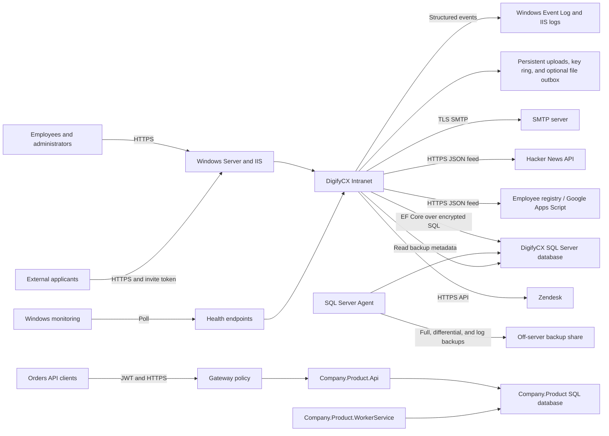
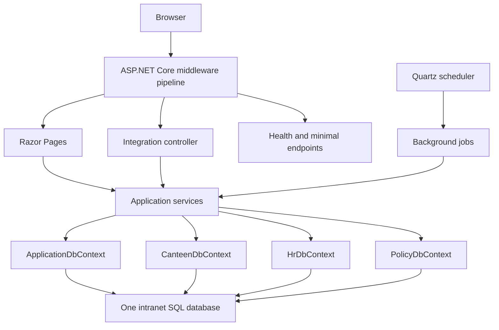
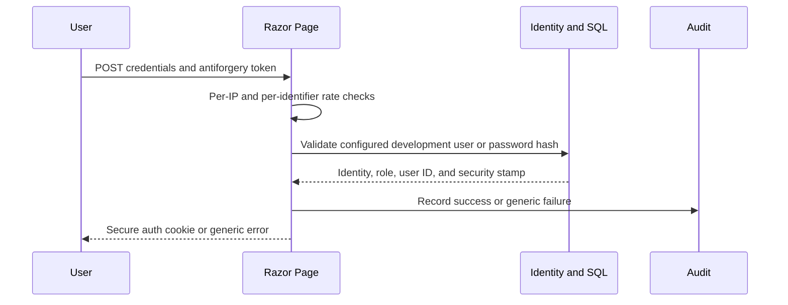

# DigifyCX Intranet System Context

This document is the technical orientation guide for the repository. It explains the deployed systems, architecture, technology stack, integrations, data ownership, security and reliability mechanisms, operational model, and the main paths through the code.

The root [README](../README.md) remains the product and functional specification. The [production hosting checklist](production-hosting-checklist.md) and [API security profile](api-security-profile.md) remain the detailed operational and endpoint runbooks.

## Scope and system boundary

The solution contains two independent application families:

1. **DigifyCX Intranet** is the production application in the repository root. It is an IIS-hosted Razor Pages modular monolith for employees, HR, finance, canteen, and system administrators.
2. **Company.Product** is a separate Clean Architecture orders API and worker baseline under `src/`. It builds and tests with the solution, but it does not share the intranet database, models, UI, or deployment scripts.

Do not treat `Company.Product` as an API layer for the intranet. Any future connection between the two systems must be designed as an explicit integration contract.

## System context



## Solution topology

| Component | Responsibility | Runtime status |
| --- | --- | --- |
| `DigifyCXIntranet.csproj` | Razor Pages UI, Identity, integrations, Quartz jobs, health endpoints, and intranet persistence | Primary production application |
| `Data/` and `Models/` | EF Core contexts, migrations, indexes, and persistent intranet entities | Production |
| `Pages/` | Employee and role-scoped server-rendered workflows | Production |
| `Services/` | Application, integration, validation, export, security, audit, and health services | Production |
| `BackgroundJobs/` | Quartz job adapters and stable job identities | Production |
| `Controllers/` | Inbound Zendesk password-reset webhook | Production |
| `deploy/` | IIS setup, publishing, secret checks, environment setup, and deployment runbooks | Operator-controlled |
| `src/Company.Product.Domain` | Order aggregate and domain invariants | Reference baseline |
| `src/Company.Product.Application` | Order use cases, validators, and persistence abstractions | Reference baseline |
| `src/Company.Product.Contracts` | Versioned API DTOs and error codes | Reference baseline |
| `src/Company.Product.Infrastructure` | Orders EF Core context and persistence implementations | Reference baseline |
| `src/Company.Product.Api` | JWT-protected versioned REST API | Independently deployable, not part of intranet deployment |
| `src/Company.Product.WorkerService` | Operational heartbeat worker using the orders infrastructure | Independently deployable baseline |
| `src/Company.Product.Gateway` | TLS, CORS, JWT, validation, and rate-limit policy example | Configuration sample |
| `tests/` | Unit, integration, architecture, migration, and contract tests | CI quality gate |

The root project explicitly excludes `src/**` and `tests/**` from its compile and publish inputs. Separation is therefore enforced both structurally and by the solution layout.

## Primary architecture

The intranet is a **modular monolith**. Features run in one ASP.NET Core process and one physical SQL Server database, while page folders, services, models, authorization policies, and focused DbContexts provide module boundaries.



### Context ownership

- `ApplicationDbContext` is the aggregate context and migration owner. It includes ASP.NET Core Identity plus all intranet entities.
- `CanteenDbContext`, `HrDbContext`, and `PolicyDbContext` expose narrower module-specific models against the same connection string.
- Schema changes belong in `Data/Migrations` and must be applied before new application code accepts traffic.
- The application contains a legacy schema-repair path for older installations, but reviewed EF migration scripts are the normal production deployment mechanism.

### Request pipeline

Requests pass through these major controls in order:

1. Trusted proxy headers establish the original scheme and client address.
2. Production exception handling, HSTS, HTTPS redirection, and security headers protect transport and browser behavior.
3. Routing selects Razor Pages, controllers, health checks, or minimal endpoints.
4. Windows Negotiate or cookie authentication creates the principal.
5. Global and endpoint-specific fixed-window rate limits reject excess traffic with HTTP 429.
6. The fallback authorization policy requires authentication unless an endpoint is explicitly anonymous.
7. Named role policies protect finance, HR, canteen, announcements, user management, and system operations.
8. Antiforgery validation protects state-changing browser and controller requests except explicitly designed webhook flows.
9. Page handlers and services validate inputs before EF Core or external calls.

## Functional systems

| System | Main capabilities | Primary code |
| --- | --- | --- |
| Account lifecycle | Login, logout, activation, forgot-password request, reset, cookie revalidation | `Pages/Account`, Identity services |
| Employee home and profile | Announcements, jobs, policies, spend, and recent activity | `Pages/Index*`, `Pages/Profile` |
| Canteen | Menu management, ordering, batching, exports, and employee totals | `Pages/Canteen`, `Pages/Admin/Canteen*`, canteen services |
| Finance | Filtered ledger, XLSX export, finance audit history | `Pages/Finance`, export and audit services |
| Recruitment | Job administration, internal applications, referrals, external applications | `Pages/Jobs`, `Pages/External`, HR services |
| Policies | Zendesk synchronization, local policy library, acknowledgements, compliance reporting | `Pages/Policies`, `Pages/Admin/Policies*` |
| Communications | Announcements and FAQs | `Pages/Announcements`, `Pages/Faq`, admin pages |
| Operations | Job status, health, backup freshness, runtime status, audit records | `Pages/Admin/Operations*`, health and job-run services |

## Technology stack

| Layer | Technology and mechanism |
| --- | --- |
| Runtime | .NET 8 and ASP.NET Core 8 |
| Web UI | Razor Pages, Razor views, Bootstrap assets, Tailwind 3 generated CSS, custom CSS, and vanilla JavaScript |
| Authentication | ASP.NET Core Identity, cookie authentication, or Windows Negotiate |
| Authorization | Claims, fallback authentication, and named role policies |
| Persistence | Entity Framework Core 8 and SQL Server |
| Scheduling | Quartz.NET 3 with optional SQL persistent store and clustering |
| Documents | ClosedXML for XLSX generation |
| HTML safety | HtmlSanitizer for synchronized Zendesk content |
| HTTP clients | `IHttpClientFactory`, bounded timeouts, HTTPS option validation, and `System.Text.Json` |
| Email | SQL-backed durable outbox, Quartz dispatcher, `SmtpClient`, and optional filesystem mirror |
| Monitoring | ASP.NET Core health checks, structured application logs, Windows Event Log, and IIS logs |
| API baseline | Controllers, JWT bearer auth, strict JSON binding, CORS, ProblemDetails, Swagger/OpenAPI |
| Tests | xUnit, FluentAssertions, ASP.NET Core test host, EF Core InMemory, NetArchTest, and coverlet |
| Delivery | GitHub Actions on Windows plus PowerShell IIS deployment tooling |

Node.js is a build-time dependency only. CI uses it to rebuild and verify the committed Tailwind output; it is not required by the deployed ASP.NET Core process.

## Integration catalogue

| Integration | Direction | Purpose | Protection and failure behavior |
| --- | --- | --- | --- |
| SQL Server | Intranet to SQL | Identity, business data, audit, job runs, email outbox, and Quartz persistence | Production requires encrypted transport with trusted certificates; EF retries transient connections three times and uses a 30-second command timeout |
| Zendesk Help Center | Intranet to Zendesk | Synchronize policy categories, sections, and articles | HTTPS-only configuration, API authentication, page-count/response-size limits, cycle detection, HTML sanitization, and preservation of the previous local cache on failure |
| Zendesk Tickets | Intranet to Zendesk | Internal applications, referrals, and forgot-password support tickets | Typed client timeout, safe attachment filename, upload validation before submission, structured outcome logging, and local workflow records |
| Zendesk reset webhook | Zendesk to intranet | Reset an account after the support workflow approves it | Anonymous route by design, shared-secret authentication with fixed-time comparison, route rate limit, constrained DTO, and audit record |
| Employee registry | Intranet to HTTPS JSON endpoint | Create, update, and optionally remove database users | Validated HTTPS URL, bounded timeout, scheduled non-concurrent sync, and persisted run outcome |
| Hacker News | Intranet to public API | Populate the cached technology-news feed | HTTPS-only URL, timeout, bounded parallel item requests, in-memory cache, and graceful retention of the last successful data |
| SMTP | Intranet to mail server | Deliver canteen batches, payroll reports, and operational email | Messages and attachments are committed to SQL first, then sent by a retryable Quartz dispatcher; failed rows remain visible for operations |
| Filesystem | Intranet to persistent storage | Menu/job images, data-protection keys, generated artifacts, and optional email mirror | Normalized filenames, constrained directories, file signature checks for uploads, DPAPI-protected key ring on Windows, and least-privilege ACL requirements |
| SQL Server Agent | SQL Agent to backup share | Authoritative database backup execution | Full, differential, and log backup jobs write outside the web server; the app only reads `msdb` freshness metadata |
| JWT authority | Orders API to identity provider metadata | Validate API bearer tokens | HTTPS metadata, configured audience, and `orders.read` / `orders.write` scope policies |
| API gateway | Client to orders API | Edge TLS, JWT, CORS, request validation, and throttling | YAML policy requires TLS 1.2+, HTTPS upstream, allowed origins, scopes, body limits, and correlation IDs |

No integration secret belongs in source control. Production values are supplied through environment variables, IIS configuration, or another protected server-side secret store.

## Core mechanisms

### Authentication and authorization

- Production can use Windows Negotiate authentication; development and configured non-Windows environments use Identity-backed cookies.
- The cookie contains user identity and role claims. Database-backed sessions also carry the user ID and security stamp, which are periodically revalidated so resets, deletion, and role changes revoke stale sessions.
- The default authorization policy requires an authenticated user. Anonymous access is limited to explicit account, external application, webhook, CSP report, and health use cases.
- Role policies are defined centrally in `Services/AppPolicies.cs` and `Services/AppRoles.cs`. Page conventions in `Program.cs` are the authoritative folder and page access map.
- Login abuse is controlled by global, per-route, and per-identifier limits. Account lockout is intentionally not the primary control in the current posture.
- Data-protection keys persist outside `wwwroot`. Production Windows hosts can protect them with DPAPI; multiple nodes require a shared key ring and a portable certificate-backed protector.

### Transport and browser security

- IIS terminates HTTPS and forwards the original scheme and client IP. Forwarded-header trust must be restricted at the edge to known proxies.
- HSTS is enabled outside development, HTTPS redirection is enforced, and Kestrel/IIS request body limits are aligned.
- Security middleware emits frame denial, MIME sniffing protection, referrer controls, permissions controls, and Content Security Policy headers.
- CSP starts in report-only mode in the production example. Operators review reports before switching to enforcement.
- SQL connection validation rejects insecure production combinations such as `TrustServerCertificate=True` unless an explicit internal-test exception is enabled.
- The orders gateway profile requires TLS 1.2 or later and HTTPS upstream transport.

### Input and data validation

- Options use DataAnnotations and startup validation. Invalid schedules, time zones, URLs, sizes, and dependent settings prevent the process from starting.
- Razor Page input models use model binding and validation attributes. Server-side handlers remain the trust boundary.
- Resume and image uploads are checked for presence, maximum size, extension, declared content type, and magic bytes. Filenames pass through `Path.GetFileName` and invalid-character replacement.
- Global request and multipart limits cap resource consumption before feature-specific file checks run.
- The orders API rejects unknown JSON members, validates DTOs and application commands, and returns a stable ProblemDetails shape with `errorCode`, field errors, and correlation ID.
- EF Core DataAnnotations validation and database constraints/indexes provide final persistence safeguards.

### Audit and observability

- `CorrelationIdMiddleware` accepts or creates a correlation ID and makes it available to logs and responses.
- General audit rows capture actor, action, entity, entity ID, success, short error code, correlation ID, remote IP, user agent, route, timestamp, and redacted detail.
- Authentication outcomes, access denial, account changes, public submissions, exports, administrative changes, webhook outcomes, and major integration actions are audit targets.
- Audit writing is best-effort: a database failure is logged and the user request continues. Monitoring must therefore alert on audit-write failures.
- Each Quartz execution records start, completion or failure, next fire time, attempt, item count, and a bounded message in `BackgroundJobRuns`.
- `/Admin/Operations` presents recent job and outbox state to authorized operators.

### Reliability and background work

- Stable Quartz job keys prevent accidental duplicate identities across restarts.
- Every current intranet job uses `DisallowConcurrentExecution` to prevent overlapping executions for the same job definition.
- Production should use the Quartz SQL persistent store. This requires the Quartz SQL Server schema matching the deployed package version.
- A single IIS instance is the default. Multiple active instances require both persistent Quartz storage and clustering, plus a shared data-protection key ring.
- IIS must keep the application pool always running with idle timeout disabled because scheduled work runs inside the web process.
- Canteen and payroll use unique run keys as a second idempotency boundary against duplicate business output.
- Operational email is always queued in SQL before delivery. Attachments are retained for retries and cleared after successful delivery to reduce database growth.

### Performance and scaling

- List pages use server-side pagination with bounded page sizes, `Skip`/`Take`, projections, and `AsNoTracking` for read-only queries.
- Exports remain unpaginated by design, but require filters, enforce a maximum result size, and create audit records.
- Composite indexes follow common filters and sort orders for announcements, canteen, finance audit, jobs, policies, acknowledgements, sync status, job runs, and outbox dispatch.
- External clients use bounded timeouts. Hacker News item retrieval has bounded parallelism; Zendesk pagination has explicit page and payload ceilings.
- The technology-news cache is process-local. It is suitable for the current single-node IIS model; multiple nodes may show slightly different refresh times.
- ASP.NET Core rate-limit counters are also process-local. A multi-node deployment needs equivalent gateway limits or a distributed limiter to enforce one shared quota.

## Data architecture

The primary database contains these entity groups:

| Group | Representative entities |
| --- | --- |
| Identity | `ApplicationUser` and ASP.NET Core Identity role, claim, login, and token tables |
| Communications | `Announcement`, `FaqItem` |
| Canteen and payroll | `MenuItem`, `CanteenOrder`, `CanteenBatchRun`, `PayrollRun` |
| Recruitment | `JobPosting`, `ReferralInvite`, `InternalJobApplication`, `ExternalApplication` |
| Policies | `PolicyDocument`, `ZendeskPolicyArticle`, `PolicyAcknowledgement`, `ZendeskSyncLog` |
| Account support | `AccountActivationLog`, `ForgotPasswordRequest` |
| Audit and operations | `AuditLog`, `FinanceAuditLog`, `BackgroundJobRun` |
| Messaging | `EmailOutboxMessage`, `EmailOutboxAttachment` |

Important consistency rules include unique canteen/payroll run keys, unique referral tokens, version-specific policy acknowledgement uniqueness, and indexed status/time access paths for operations.

The `Company.Product` database is separate and contains the `Order` aggregate and `OrderItem` children. Its application layer owns use-case validation, while Infrastructure owns EF Core mappings and SQL access.

## Scheduled jobs

| Stable job key | Responsibility | Schedule source |
| --- | --- | --- |
| `canteen-breakfast-batch` | Close and export the breakfast order batch | `CanteenBatching:BreakfastCron` |
| `canteen-lunch-batch` | Close and export the lunch order batch | `CanteenBatching:LunchCron` |
| `monthly-payroll-export` | Aggregate monthly canteen payroll deductions and queue the XLSX email | `JobScheduling:PayrollCron` |
| `zendesk-policy-sync` | Refresh local Zendesk policy content | `JobScheduling:ZendeskPolicySyncIntervalHours` |
| `user-registry-sync` | Reconcile Identity users with the employee registry | `JobScheduling:UserRegistrySyncIntervalHours` |
| `tech-news-refresh` | Refresh the in-memory home-page news cache | `JobScheduling:TechNewsIntervalMinutes` |
| `email-outbox-dispatch` | Send pending SQL outbox messages in bounded batches | `JobScheduling:EmailDispatchIntervalMinutes` |

Jobs are enabled conditionally where their integration is optional. Retry and misfire behavior are configured centrally in `Program.cs` and `JobScheduling` options.

## Health and backup model

| Endpoint | Meaning | Main dependencies |
| --- | --- | --- |
| `/health/live` | Process is running | Self-check only |
| `/health/ready` | Process can serve meaningful traffic | Runtime resources, SQL, backup freshness, and enabled critical jobs |
| `/health/database` | Database and backup chain are acceptable | SQL connectivity and `msdb` backup metadata |
| `/health/runtime` | Runtime pressure is within warning thresholds | GC memory load and thread-pool queue |

SQL Server Agent, not the web application, owns backup execution. The application evaluates the latest full, differential, and transaction-log backup ages. A recent full backup can satisfy the differential freshness window; databases using the `FULL` recovery model must also have a fresh log backup.

A healthy endpoint does not prove restorability. The monthly restore drill in the production checklist is the authoritative validation of the backup chain and expected RPO/RTO.

## Important end-to-end flows

### Cookie login



### External application

1. An employee creates a referral invite with a random, unique, expiring token.
2. The candidate opens the anonymous tokenized page and submits validated fields and a validated resume.
3. Route and global rate limits constrain abuse.
4. The service creates the Zendesk ticket and stores the local application outcome without exposing credentials or internal error detail.
5. The action is audited with request metadata and correlation ID.

### Durable email

1. A business service creates an email and optional attachment in memory.
2. `SmtpOrOutboxEmailSender` commits the message and attachment bytes to SQL and optionally writes a filesystem mirror.
3. Quartz invokes `email-outbox-dispatch` in bounded batches.
4. The dispatcher marks attempts and sends through SMTP.
5. Success clears attachment payload bytes; retryable failures return to pending; the fifth failed attempt remains failed for operator review.

### Zendesk policy synchronization

1. Quartz or an authorized administrator starts synchronization.
2. The service reads bounded Zendesk category, section, and article pages over HTTPS.
3. Allowed sections are applied, HTML is sanitized, and records are upserted into the local policy cache.
4. A complete successful pass removes stale local articles; a failed pass preserves the prior cache.
5. Sync logs, job-run records, health evaluation, and application logs expose the outcome.

## Configuration map

| Section | Purpose |
| --- | --- |
| `ConnectionStrings:DefaultConnection` | Primary intranet SQL Server connection |
| `AuthMode` and `Activation` | Authentication selection, controlled test behavior, and activation settings |
| `AdminAccess` | Configured identity-to-role mappings, especially for Windows auth |
| `ZendeskSync` and `ZendeskWebhook` | Outbound Zendesk API and inbound webhook security |
| `UserRegistrySync` | Employee registry endpoint and reconciliation behavior |
| `RateLimitPolicies` | Global and sensitive-route quotas |
| `BrowserSecurity` and `RequestLimits` | CSP and request-size controls |
| `DataProtection` | Shared application name, key-ring path, and Windows key protection |
| `BackupHealth`, `Monitoring` | Backup, critical-job, and runtime health thresholds |
| `JobScheduling`, `CanteenBatching`, `Payroll` | Quartz persistence and schedules |
| `TechNews` | Feed URL, timeout, count, and concurrency |
| `Smtp`, `Outbox`, `RoutingInboxes` | Durable email delivery and business recipients |
| `SqlServerSecurity` | Narrow internal-test exception for SQL certificate trust |

Use [appsettings.Production.example.json](../appsettings.Production.example.json) as a schema and safe-default reference only. Do not deploy placeholder values or commit a populated production settings file.

## Hosting and deployment model

- Target platform: Windows Server, IIS reverse proxy, ASP.NET Core Hosting Bundle, and SQL Server.
- Use a dedicated least-privilege app-pool identity with `No Managed Code`, 64-bit mode, preload, and `AlwaysRunning`.
- Grant write access only to required upload, outbox, key-ring, and log locations.
- Apply reviewed idempotent EF migration SQL before changing application binaries or routing traffic.
- Create the Quartz SQL schema before enabling persistent scheduling.
- Publish through the `deploy/` scripts, run the publish secret scan, preserve the previous deployment for rollback, and keep production secrets outside the artifact.
- Backups go to an off-server share and are restored to a validation database at least monthly.
- Monitor Windows Event Log, IIS logs, health endpoints, job failures, pending/failed email rows, authentication failures, and repeated 429 responses.

See [production-hosting-checklist.md](production-hosting-checklist.md) for the executable checklist and [deploy/README.md](../deploy/README.md) for scripts and runbooks.

## Development and verification

Prerequisites are the .NET 8 SDK, SQL Server or LocalDB, and Node.js only when rebuilding CSS.

```powershell
dotnet restore DigifyCXIntranet.sln
npm ci
npm run build:css
dotnet build DigifyCXIntranet.sln --no-restore --configuration Release
dotnet test DigifyCXIntranet.sln --no-build --configuration Release
```

For schema validation and deployment review:

```powershell
dotnet tool restore
dotnet tool run dotnet-ef migrations script --idempotent `
  --context ApplicationDbContext `
  --project DigifyCXIntranet.csproj `
  --startup-project DigifyCXIntranet.csproj `
  --configuration Release `
  --output artifacts\migrations.sql
```

CI additionally audits npm and NuGet dependencies, verifies that generated Tailwind CSS is current, builds the full solution, generates the migration script, and runs all tests.

## Change guide

When changing the system, update the corresponding boundary:

| Change | Required follow-through |
| --- | --- |
| New page or endpoint | Declare authentication/authorization intent, rate-limit need, validation, audit behavior, and update the API security profile if applicable |
| New entity or query | Add a migration, verify indexes against filter/sort shape, use projections and bounded reads, and add migration/query tests |
| New external integration | Add validated options, HTTPS enforcement, timeout and payload bounds, structured logs, health impact, retry/idempotency behavior, and secret handling |
| New recurring job | Add a stable key, prevent overlap, record runs, define misfire/retry behavior, expose status, and decide whether readiness depends on it |
| New upload | Define type, size, extension, content-type, signature, filename, storage, retention, and malware-scanning expectations |
| New role capability | Update central policies, page conventions, role tests, navigation visibility, and audit coverage |
| New production node | Enable Quartz clustering, shared data-protection keys, edge/distributed rate limits, shared persistent storage, and deployment coordination |

## Architectural constraints and current boundaries

- The intranet is intentionally a modular monolith; splitting modules into network services would add operational cost and requires a demonstrated scaling or ownership need.
- Quartz jobs live in the web process. Availability depends on the IIS app-pool configuration until jobs are moved to a separately hosted worker.
- Audit writes are best-effort so an audit outage does not take down employee workflows. This makes monitoring of audit failures mandatory.
- Filesystem uploads and mirrors require persistent storage and coordinated ownership in any multi-node design.
- The rate limiter and tech-news cache are process-local; the gateway must provide shared enforcement/cache consistency if horizontal scaling is introduced.
- The orders API currently uses service-level scopes, not per-customer ownership enforcement. It must remain internal until an explicit tenant/customer claim model is implemented and tested.
- Database backup freshness is evidence of recent backup execution, not proof of successful recovery. Restore drills remain required.

## Source-of-truth references

- Product behavior and setup: [README.md](../README.md)
- Production operations: [production-hosting-checklist.md](production-hosting-checklist.md)
- Endpoint and authorization inventory: [api-security-profile.md](api-security-profile.md)
- SQL Agent jobs: [sql-agent-backup-jobs.sql](sql-agent-backup-jobs.sql)
- Intranet composition: [Program.cs](../Program.cs)
- Intranet schema and indexes: [ApplicationDbContext.cs](../Data/ApplicationDbContext.cs) and [DomainModelBuilderExtensions.cs](../Data/DomainModelBuilderExtensions.cs)
- Job identities: [JobNames.cs](../BackgroundJobs/JobNames.cs)
- Orders API composition: [Company.Product.Api/Program.cs](../src/Company.Product.Api/Program.cs)
- Gateway profile: [gateway-config.yaml](../src/Company.Product.Gateway/gateway-config.yaml)
- CI gate: [ci.yml](../.github/workflows/ci.yml)
